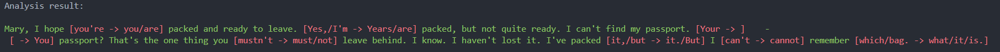
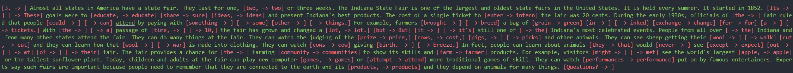
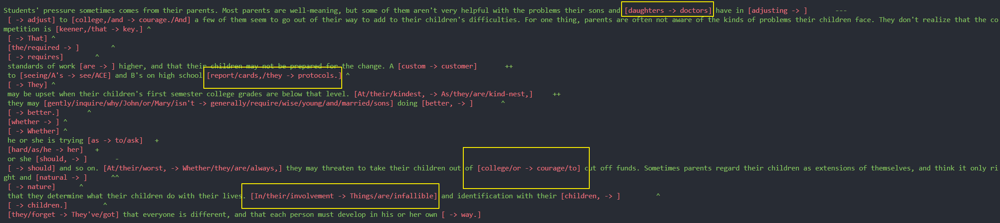

# RecordingCorrection

The script is to correct your pronunciation in your spoken English.

## How to use it

"main.py" is the entrance. I provided:

1. Split your standard audio if you need it.
2. Recognize your standard audio.
3. Reocrd your reading passage.
4. Show which words you spell wrong.

## WorkFlow

1. Split your standard audio, using ```split_standard_audio()```.
2. Please name your standard audio ```standard-audio.wav```(Step1 has done it).
3. Recognize and convert your standard audio text and display it for easy reading during recording later, using```recognize_audio```.
4. Record your voice and name it as```record_audio.wav```.
5. Recognize and convert your audio. Compare these two paragraphs of text and print the differences

## Screenshot

The green part is correct, and the red part is incorrect.
It may be differences in details, but practice in daily life should be sufficient. Our focus is on being brave enough to speak up, and what needs to be corrected is obvious errors (i.e. incorrect pronunciation that even AI cannot recognize).






## Import Lib Requirements

ffmpeg-python
torch(cuda)
whisper(openai)
